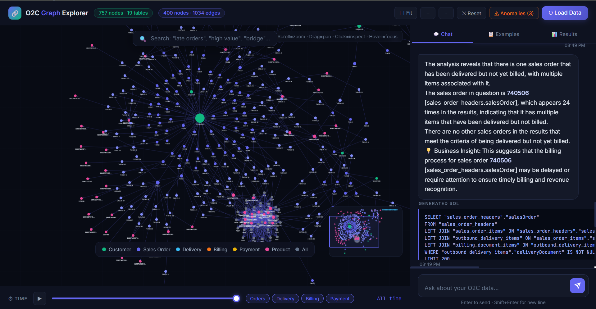

# O2C Graph Explorer

A graph-based data modeling and conversational query system for SAP Order-to-Cash data.

## Architecture

```
JSONL files → SQLite (via ingest.py) → NetworkX graph (in-memory)
                                              ↓
FastAPI backend → REST endpoints → Cytoscape.js frontend + Chat UI
                                              ↓
                        LLM (Gemini/Groq) → NL → SQL → Execute → NL Answer
```

### Why SQLite?
- Zero infrastructure setup
- Fast for analytical queries on this dataset size (~100k rows)
- Full SQL for complex multi-table O2C flow joins
- Easy to ship as a single file

### Why NetworkX in-memory?
- The graph has ~5k nodes max — fits in RAM
- Instant neighbor lookups for expand-on-click
- No external graph DB needed (avoids Neo4j/ArangoDB setup overhead)

### LLM Strategy
1. **Guardrail first**: keyword + regex check before hitting the LLM
2. **Schema injection**: full `CREATE TABLE` statements in the prompt
3. **SQL generation**: LLM outputs raw SQL only (no markdown)
4. **Self-correction**: on SQL error, feed error back to LLM for 1 retry
5. **NL answer**: separate LLM call with the result rows as context
6. **Node extraction**: column name pattern matching to find graph node IDs for highlighting

## Setup

### 1. Install dependencies
```bash
pip install fastapi uvicorn networkx python-dotenv google-generativeai aiofiles
# or: pip install groq  (if using Groq)
```

### 2. Set up API key
```bash
# .env file
GEMINI_API_KEY=your_key_here
# or
LLM_PROVIDER=groq
GROQ_API_KEY=your_key_here
```

Get a free Gemini key: https://ai.google.dev
Get a free Groq key: https://console.groq.com

### 3. Add your data
```
mkdir data/
# Put all your .jsonl files in data/
```

### 4. Run
```bash
cd backend
python -m uvicorn app:app --host 0.0.0.0 --port 8000 --reload
```

Open http://localhost:8000

### 5. Load data
Click **"⟳ Load Data"** in the top bar to ingest all JSONL files.

## Guardrails

Off-topic queries are rejected at two layers:

1. **Keyword filter** (zero LLM cost): checks if any O2C domain keywords are present
2. **Pattern blocklist**: regex for poem/story/weather/sports/celebrity requests

Response for off-topic queries:
> "This system is designed to answer questions related to the SAP Order-to-Cash dataset only."

Mutating SQL (DROP, DELETE, INSERT, UPDATE, ALTER) is blocked at execution time.

## Example Queries

- Which products have the most billing documents?
- Identify sales orders delivered but not billed
- Show the full flow for a specific billing document
- Which customers have the highest total order value?
- Which plants ship the most items?
- Find cancelled billing documents

## Deployment (free tier)

- **Railway**: connect GitHub repo, set env vars, deploy
- **Render**: free tier supports FastAPI + SQLite
- **Fly.io**: `fly launch` from backend/

## File Structure

```
├── backend/
│   ├── app.py          # FastAPI routes
│   ├── ingest.py       # JSONL → SQLite loader
│   ├── graph_builder.py # NetworkX graph + Cytoscape export
│   ├── llm_service.py  # Guardrails + SQL gen + NL answer
│   ├── schema.py       # DB introspection for LLM context
│   └── database.py     # SQLite connection
├── frontend/
│   └── index.html      # Single-file UI (Cytoscape + Chat)
├── data/               # JSONL files go here
└── README.md
```

---

## Bonus Features Implemented

### ⏱ Time Travel Slider
A timeline bar at the bottom of the graph lets you replay your entire O2C process from scratch. Click **▶ Play** or drag the slider — nodes appear in order: Sales Orders → Deliveries → Billing Documents → Payments. Bottlenecks are visible as long gaps between stage transitions.
Jump to any stage using the **Orders / Delivery / Billing / Payment** pills.

### 🔍 Semantic Search
The floating search bar above the graph accepts natural language queries — not SQL. Type:
- `"late orders"` → highlights orders with incomplete delivery status
- `"high value"` → highlights nodes with amount > 10,000
- `"bridge"` → highlights critical bridge nodes (high betweenness centrality)
- `"hub"` → medium centrality hubs
- `"delivered"`, `"unpaid"`, `"payment"`, `"customer"`, etc.

Matching nodes pulse and non-matching nodes fade to 7% opacity for immediate visual focus.

### ⚠ Anomaly Detection Panel
Click **⚠ Anomalies** in the header. Automatically detects broken O2C flows:
- **Delivered but not billed** — orange dashed borders
- **Delivery without Sales Order** — red dashed borders
- **Billing without Sales Order** — red dashed borders
- **Billed but not paid** — amber dashed borders

Each anomaly card has two buttons: **🔍 Highlight** (filters graph) and **💬 Ask AI** (auto-populates the chat with a targeted query about that anomaly).

### 🗺 Mini Map + Ghost Focus
- **Mini Map** (bottom right): Live bird's-eye view of the full graph with a viewport rectangle
- **👁 Focus** button in node detail: Ghosts all unrelated nodes to 7% opacity — only the selected node and its 2-hop neighborhood remain visible
- **Hover ghosting**: Hovering over any node automatically fades the rest of the graph

### 📐 Betweenness Centrality Node Sizing
Node sizes are computed using `networkx.betweenness_centrality()` — not just edge count. A Plant that bridges the Sales cluster to the Shipping cluster appears large because it is structurally important, even if it has few direct connections. The node detail panel labels these: "🌉 Critical bridge", "🔗 High-connectivity hub".

## 📸 Preview
> [!TIP]


> Use the **Time Travel Slider** at the bottom to visualize the document flow from Sales → Delivery → Billing.

### 🎥 System Demo
<video controls src="demo.mp4" title="Title"></video>
controls="controls" style="max-width: 100%;">
  Your browser does not support the video tag.
</video>